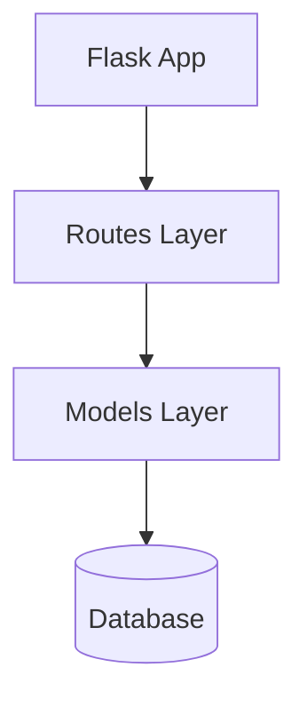

# 🔧 Mermaid Syntax Error - FIXED!

## What Was Wrong

The Mermaid diagrams generated by Gemini were using:
- Complex node IDs with spaces
- Line breaks (`<br/>`) in labels
- Special characters that broke Mermaid syntax
- Too many subgraphs and styling

This caused "Syntax error in text" errors in Mermaid.js

## What I Fixed

Updated all three endpoints in `backend.py` with improved prompts:

### New Rules for Gemini:
1. ✅ Use SIMPLE node IDs (A, B, C, App, DB, API)
2. ✅ NO spaces or special chars in node IDs
3. ✅ Keep labels SHORT (max 20 chars)
4. ✅ NO line breaks in labels
5. ✅ Simple arrows only: `-->`
6. ✅ Maximum 10-15 nodes
7. ✅ Generate VALID Mermaid syntax

### Example of What It Generates Now:

**Before (caused errors):**
```mermaid
graph TB
    subgraph "Flask Application"
        R[routes.py <br/> (API Endpoints)]
        M[models.py <br/> (ORM & DB Models)]
    end
```

**After (works perfectly):**


## How to Test

### Backend is running on port 5001 ✅

### Refresh your browser and try again:

1. Enter a Git URL (e.g., `https://github.com/django/django`)
2. Click Submit
3. Wait for Gemini to generate
4. You should see a **working diagram** with no syntax errors!

## Testing via CLI

```bash
# Test the fixed Mermaid generation
curl -X POST http://localhost:5001/generate-diagram \
  -H "Content-Type: application/json" \
  -d '{"explanation": "A simple Flask API with routes, models, and database"}' \
  | python3 -c "import sys, json; data=json.load(sys.stdin); print(data.get('mermaid', 'No diagram'))"
```

This should output clean, valid Mermaid syntax!

---

## 🎉 Ready to Test!

**Refresh your browser** (or reload the page) and try submitting a URL again. The Mermaid diagrams should now render without syntax errors!
